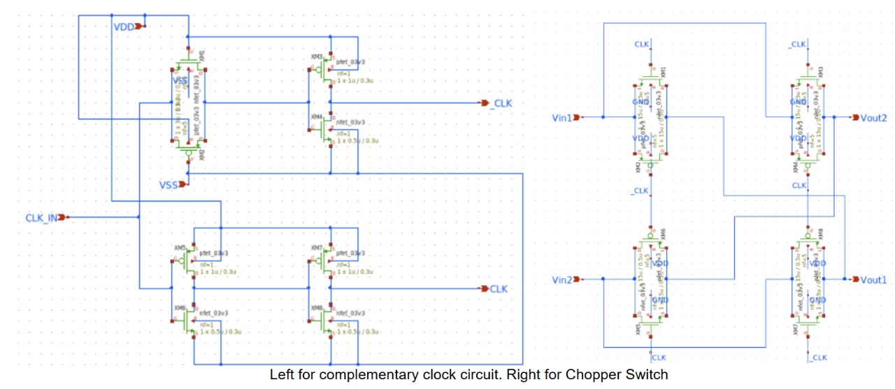
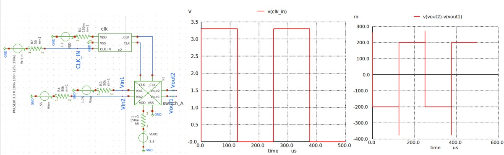
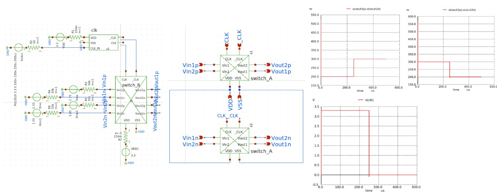
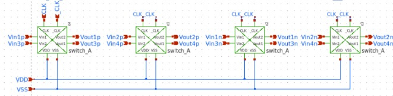
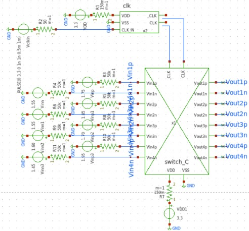
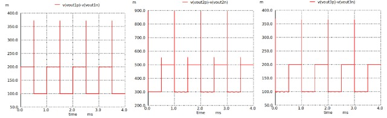
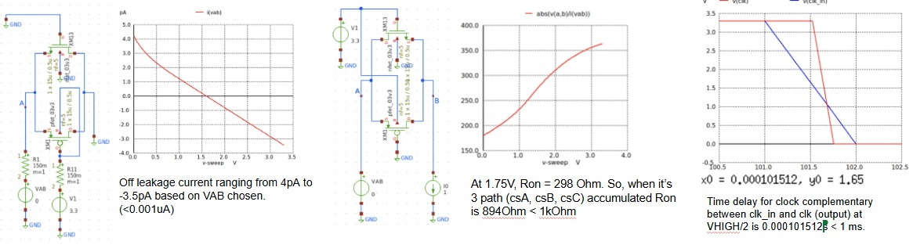

# Chopper Switch Progress Log

The chopper switch is implemented to reduce low-frequency (1/f) noise and input offset voltage that can severely degrade the quality of EEG signals. It operates by modulating the input signal with a square wave, shifting it to a higher frequency band where amplifier noise is more uniform and less intrusive. After amplification, the signal is demodulated back to baseband, effectively canceling out the low-frequency noise and offset introduced by the amplifier. 

## Target Specification

| **Parameter**                        | **Value / Target** | **Unit** |
|-------------------------------------|--------------------|----------|
| Stage 1 : Chopper A Operating Frequency       | 4              | kHz       |
| Stage 2 : Chopper B Operating Frequency       | 2            | kHz       |
| Stage 3 : Chopper C Operating Frequency       | 1               | kHz       |
| Ron                                 | <1                | kΩ       |
| Delay Time Between stages | +/-500              | ns       |
| Off Leakage Current | <0.1 | uA
| Clock divider (to _Clk and Clk) delay | <1 | ms

## Schematic Design

  

<h4 align="center" style="font-size:16px;">Figure 1. Chopper Switch Schematic</h4>

## Simulation

  

<h4 align="center" style="font-size:16px;">Figure 2. Chopper Switch A Simulation</h4>

  

<h4 align="center" style="font-size:16px;">Figure 3. Chopper Switch B Simulation</h4>

  

<h4 align="center" style="font-size:16px;">Figure 4. Chopper Switch C Schematic</h4>

  

<h4 align="center" style="font-size:16px;">Figure 5. Chopper Switch C Testbench</h4>

  

<h4 align="center" style="font-size:16px;">Figure 6. Chopper Switch C Simulation 1</h4>

  

<h4 align="center" style="font-size:16px;">Figure 7. Chopper Switch C Simulation 2</h4>

  

<h4 align="center" style="font-size:16px;">Figure 8. Chopper Switch Specification</h4>

## Performance of Designed Chopper Switch 

| **Parameter**                        | **Value / Target** | **Unit** |
|-------------------------------------|--------------------|----------|
| Stage 1 : Chopper A Operating Frequency       | 4              | kHz       |
| Stage 2 : Chopper B Operating Frequency       | 2            | kHz       |
| Stage 3 : Chopper C Operating Frequency       | 1               | kHz       |
| Ron                                 | 894 (3 ways)                | kΩ       |
| Delay Time Between stages | +/-500              | ns       |
| Off Leakage Current | +/- 4 | pA
| Clock divider (to _Clk and Clk) delay | 0.000101512 | s

**Last Updated: 16th August**
